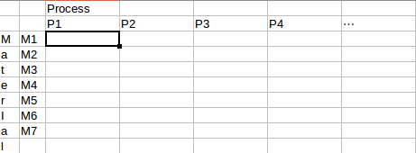
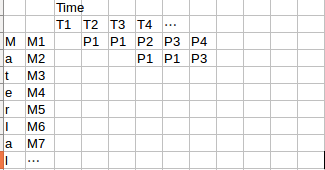

# ProcGA
Process scheduling programs using Genetic-Algorithm.
Developed with Julia language.

# Problem to solve

Suppose there are $N_M$ materials to make $(M1, M2, ...,M_{N_M})$.

Each material should pass given processes $(P1,P2,...,P_{N_P})$.

Process time of $P_j$ of Material $M_i$ is defined as $P_{ij}$.
Matrix T defines process time conditions. 
We asuume $P_{ij}$ are integers counted by smallest time unit.

Similarly, schedule matrix can be made taking horizontal time-line as a columns of time units.

The actual schedule is defined by filling cells of this matrix.

We call this process schedule matrix as T.

At best, the horizontal length of this matrix is shortest, in other words, matrix column dimension is smallest.
This column length is the value that should be minimized.

Most of the case, a process $P_j$ can handle only one material at a time.
In that case, $P_j$ should appear only once on each column.
If $P_k$ can handle many materials at once, $P_k$ appears on multiple rows of same column.

There could be some conditions, for example, total handling size must be smaller than a given limit, or, M1 and M2 can not be combined, etc.
Such condition must be considered when forming a schedule matrix.

# GA Algorithm

$$
T_P = \sum_{i,j} P_{ij}
$$
is longest time span needed to execute all process.

So any process schedule matrix can be packed into matrix size $N_M, T_P$.

Randomly filling cells with required $P_{ij}$ makes an initialized starting gene, though
it must be fixed with constraint condition.

And making many these genes constructs a first generation of population.

Then under death ratio, crossover parameter and mutation probability, we can translate generations to find better solution.

